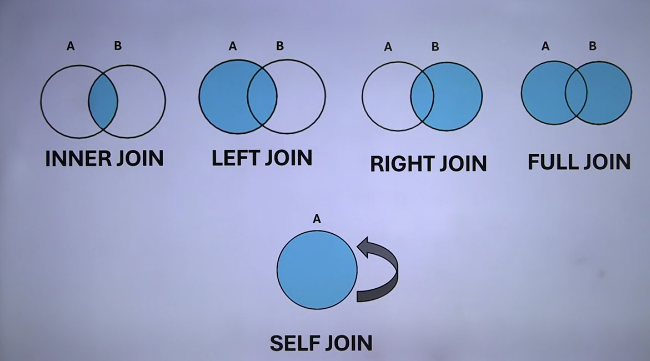

# SQL JOINS

Joins are used to retrieve data from multiple tables in a database by combining rows based on a common column.
- Wen we use join we have to use **on**

## Types of Join

- **Equi Join (Inner Join)**
- **Natural Join**
- **Outer Join**
  - **Left Outer Join**
  - **Right Outer Join**
  - **Full Outer Join**
- **Self Join**
- **Cross Join**

## Sample Table for Subqueries

### Ticket Booking Table

| booking_id | movie_name    | show_date  | customer_name   | num_tickets | ticket_price |
|------------|---------------|------------|------------------|-------------|--------------|
| 1          | Bhumi Geeta   | 2024-01-15 | Rajesh Kumar     | 3           | 12.50        |
| 2          | Akash         | 2024-01-16 | Priya Sundaram   | 2           | 10.00        |
| 3          | Bhumi Geeta   | 2024-01-15 | Ankit Singh      | 4           | 12.50        |
| 4          | Bandana       | 2024-01-17 | Neha Gupta       | 2           | 11.00        |
| 5          | Akash         | 2024-01-18 | Amit Sharma      | 5           | 10.00        |

---

### Customer Table

| customer_id | customer_name | email                   |
|-------------|---------------|-------------------------|
| 101         | John Doe      | <john.doe@example.com>    |
| 102         | James Smith   | <james.smith@example.com> |
| 103         | Bob Johnson   | <bob.johnson@example.com> |
| 104         | Alice William | <alice.w@example.com>     |
| 105         | Akash Pandey  | <akash.p@example.com>     |
| 106         | Ankit Kumar   | <ankit.k@example.com>     |

---

### Order Table

| order_id | customer_id | order_date | total_amount |
|----------|-------------|------------|--------------|
| 1        | 101         | 2024-02-01 | 50.00        |
| 2        | 101         | 2024-02-05 | 30.25        |
| 3        | 102         | 2024-02-02 | 75.00        |
| 4        | 103         | 2024-02-03 | 120.00       |
| 5        | 104         | 2024-02-04 | 90.50        |
| 6        | 106         | 2024-02-06 | 60.00        |
| 7        | 106         | 2024-02-07 | 45.00        |

---

### Equi join

Equi join, also known as inner join, combines rows from two tables based on a common column with matching values.
- **Equi join and Inner join are same in equi join we don't have to use the keyword in inner join we have to use the keyword**

#### Example

Tables:

- **Customer Table:**
  - CustomerID
  - CustomerName
- **Order Table:**
  - OrderID
  - CustomerID
  - Product
  - OrderDate

#### Query

``` SQL
-- Display the customer_id from customer table who has made atleast one order
SELECT customers.customer_id  FROM orders, customers WHERE customers.customer_id = orders.customer_id;

SELECT customers.customer_id  FROM customers  JOIN orders  ON customers.customer_id = orders.customer_id;
```

#### Explanation

This query selects the CustomerID from the Customer table where it matches the CustomerID in the Orders table.

### Natural Join

Natural join automatically matches columns with the same name in both tables and returns rows with matching values.

#### Query

``` SQL
SELECT *  FROM Customer  NATURAL JOIN Orders;
```

#### Explanation

The natural join matches columns with the same name in both tables and eliminates duplicate columns in the output.

### Left Outer Join

Left outer join returns all rows from the left table and the matched rows from the right table. If there is no match, NULL values are returned for columns from the right table.

#### Query

``` SQL
SELECT Customer.CustomerID, Orders.OrderID  FROM Customer  LEFT JOIN Orders  ON Customer.CustomerID = Orders.CustomerID;
```

#### Explanation

This query returns all CustomerIDs from the Customer table and the corresponding OrderIDs from the Orders table. If a customer has not placed any orders, the OrderID will be NULL.

### Right Outer Join

Right outer join returns all rows from the right table and the matched rows from the left table. If there is no match, NULL values are returned for columns from the left table.

#### Query

``` SQL
SELECT Customer.CustomerID, Orders.OrderID  FROM Customer  RIGHT JOIN Orders  ON Customer.CustomerID = Orders.CustomerID;
```

#### Explanation

This query returns all OrderIDs from the Orders table and the corresponding CustomerIDs from the Customer table. If an order has no corresponding customer, the CustomerID will be NULL.

### Full Outer Join

Full outer join returns all rows from both tables, with NULL values in place where there is no match.

#### Query

``` SQL
SELECT Customer.CustomerID, Orders.OrderID  FROM Customer  FULL OUTER JOIN Orders  ON Customer.CustomerID = Orders.CustomerID;
```

#### Explanation

This query returns all rows from both Customer and Orders tables. If there is no match, NULL values are included in the result set.

### Self Join

Self join is used to join a table with itself, comparing rows within the same table.

#### Scenario

Suppose we have an Employee table with columns EmployeeID, Name, and ManagerID.

#### Query

``` SQL
SELECT e1.Name AS Employee, e2.Name AS Manager  FROM Employee e1  JOIN Employee e2  ON e1.ManagerID = e2.EmployeeID;
```

#### Explanation

This query joins the Employee table with itself to list employees and their respective managers.

### Cross Join

Cross join returns the Cartesian product of two tables, combining all rows from both tables.

#### Query

``` SQL
SELECT *  FROM Customer  CROSS JOIN Orders;
```

#### Explanation

This query returns the Cartesian product of Customer and Orders tables, resulting in all possible combinations of rows from both tables.


## Example
#### Tables used for Join

**Table1**

| A | B |
|---|---|
| 1 | 2 |
| 3 | 4 |
| 5 | 6 |
| 7 | 8 |

**Table2**

| A | B |
|---|---|
| 4 | 1 |
| 3 | 1 |
| 8 | 1 |

**Table3**

| A | B |
|---|---|
| 1 | 1 |
| 2 | 3 |
| 4 | 4 |
| 7 | 9 |


``` SQL
USE Others;

-- Create sample table1 for join examples
CREATE TABLE table1 (
  A INT,
  B INT
);
INSERT INTO table1 (A, B) VALUES (1, 2), (3, 4), (5, 6), (7, 8);
SELECT * FROM table1

-- Create sample table2 for join examples
CREATE TABLE table2 (
  B INT,
  C INT
);
INSERT INTO table2 (B, C) VALUES (4, 1), (3, 1), (8, 1);
SELECT * FROM table2;

-- Equi Join Example
-- Write a query to perform an equi join on table1 and table2 where table1's column B is equals to table2's column B
SELECT *
FROM table1, table2
WHERE table1.B = table2.B;

-- Inner Join Example
-- Write a query to perform an inner join on table1 and table2 
SELECT *
FROM table1
INNER JOIN table2
ON table1.B = table2.B;

-- Natural Join
-- Write a query to perform a natural join on table1 and table2
SELECT *
FROM table1
NATURAL JOIN table2; -- Here no need to define the comparing condition, it will be defiend automatically

-- Left Outer Join Example
-- Write a query to perform a left join on table1 and table2
SELECT * 
FROM table1
LEFT JOIN table2
ON table1.B = table2.B;

-- Right Outer Join Example
-- Write a query to perform a right join on table1 and table2
SELECT * 
FROM table1
RIGHT JOIN table2
ON table1.B = table2.B;

-- Full Outer Join Example
-- Write a query to perform a full outer join on table1 and table2
SELECT * 
FROM table1
FULL JOIN table2
ON table1.B = table2.B;

-- Cross Join Example
-- Write a query to perform a cross join on table1 and table2
SELECT * 
FROM table1
CROSS JOIN table2;
SELECT * FROM table1, table2; -- Alternative syntax for cross join

-- self join Example
-- This table os to demonstrate self join
CREATE TABLE table3 (
    A INT,
    B INT
);
INSERT INTO table3 (A, B) VALUES (1, 1), (2, 3), (4, 4), (7, 9);
SELECT * FROM table3;
-- Write a query to display table3's column A and B where table3's column A by performing self join where table3's A is equal to table3's B
SELECT a.A, b.B
FROM table3 a
INNER JOIN table3 b
ON a.A = b.B;
```

### All types of Join
